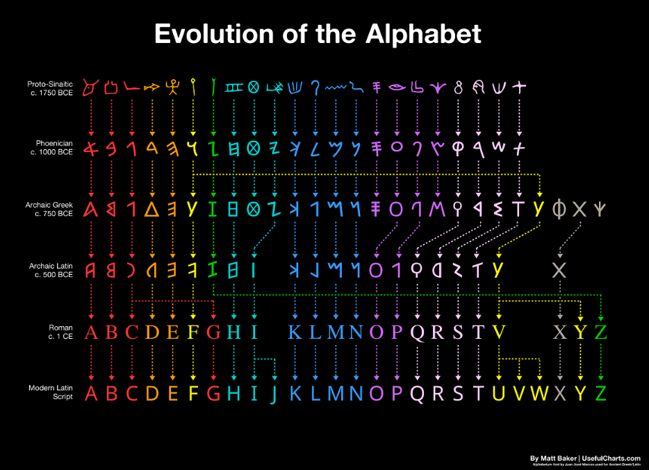

# Ceasar_cipher

## One of the oldest still (somewhat) used ciphers

2000 years ago, Gaius Julius Ceasar, needed a way to make sure that when the enemy intercepted a mail carrier that they couldn't read the messages.
So he sat down, and created the "Ceasar Cipher".
It's a fairly simple idea where you shift the alphabet one letter and get unreadable language where you need a key to decipher it.
People often call people from our history "barbaric" and "not civilized", the irony is there, but these people were mathmatically so much further than your typical human now, it's amazing.

Back then you did not have computers that could decypher 24 keys (fun fact the latin alphabet had only 24 letters, where we have 26). But they had scholars that would help with deciphering these kind of decoded messages.
Throw in the fact that Gaius Julius Ceasar was very educated in multiple languages and you don't only need a single language, you need multiple.
Julius Ceasar was known to write his reports that would be considered public knowledge in Latin. However, correspondance with his fellow officers would be in Greek. Not only was this extremely helpful during civil unrest when he was hunting down and fighting his roman enemies armies. During his gealic expeditions, this would have been very helpful as well.
A smart man indeed!

## Should you still use this method?
Depends! Do you really want to make something that is really hard to crack and smart people will need more than a couple of minutes to understand what this is?
No, then definitely not! You can see paterns, especialy if you do not include spaces in the decryption, then you'd see where an I or A could be placed and it's downhill from there for your "security".

If you want to mess around and the people around you do not know cryptography and will not have any interest after the initial 0.1 seconds, then go have fun!
It takes a moment to decypher, especialy if you don't have the key. Although guessing 26 times what the key is, won't be a week of your time, perhaps an afternoon if you go slow.

It's a fun and educational way to learn crypthography and I'd reccomend it to everyone wanting to start with it!
